# Test model for Koch Robot's on-wrist Camera

12/07/2024

Tony Wang

> Here is 9 typical images from @Edward's litte robot.
> 
> I tested 2 foundation models: Depth-Pro and DINO-X.
> 
> I also tested iPhone SE 2022 camera.
> 
> Please check the folder for more details.

## Depth-Pro: 

- **Minimum Depth:** The smallest recorded depth across all cameras ranges from approximately \(209.21 \, \text{m}\) to \(259.53 \, \text{m}\).
- **Maximum Depth:** The largest recorded depth across all cameras varies significantly, from \(593.51 \, \text{m}\) to \(851.93 \, \text{m}\).
- **Mean Depth:** The average depth values for all images are fairly consistent, ranging from \(331.82 \, \text{m}\) to \(433.94 \, \text{m}\).

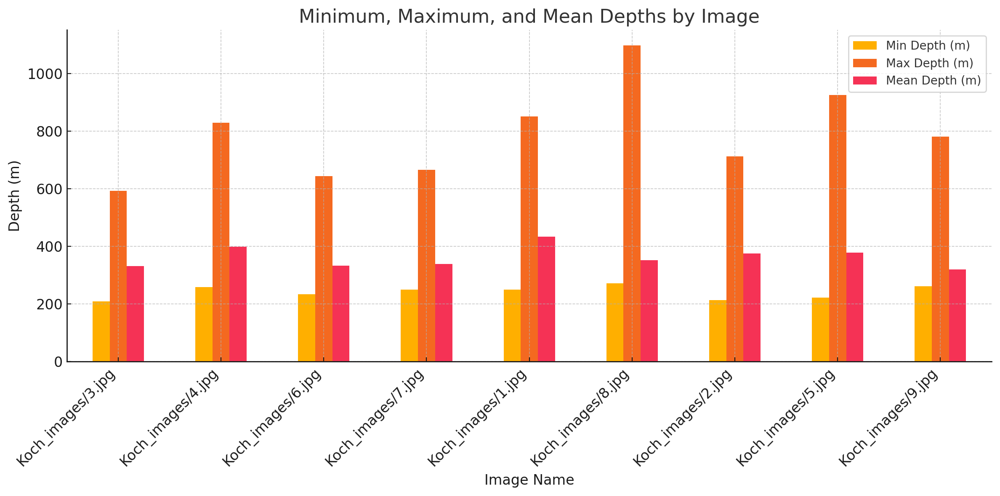

can not validate as their is no GT

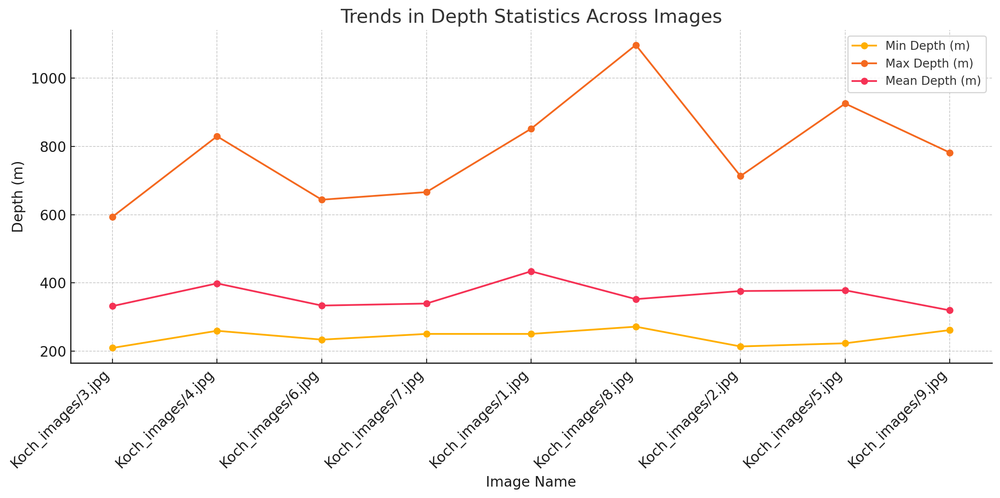

---

## DINO-X
- prompt-free mode 

https://deepdataspace.com/playground/dino-x

### example and my idea
1. many objects
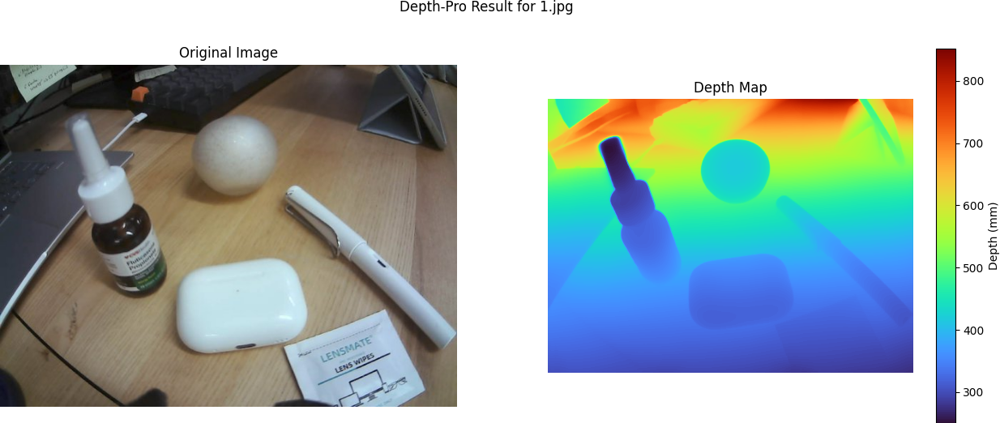
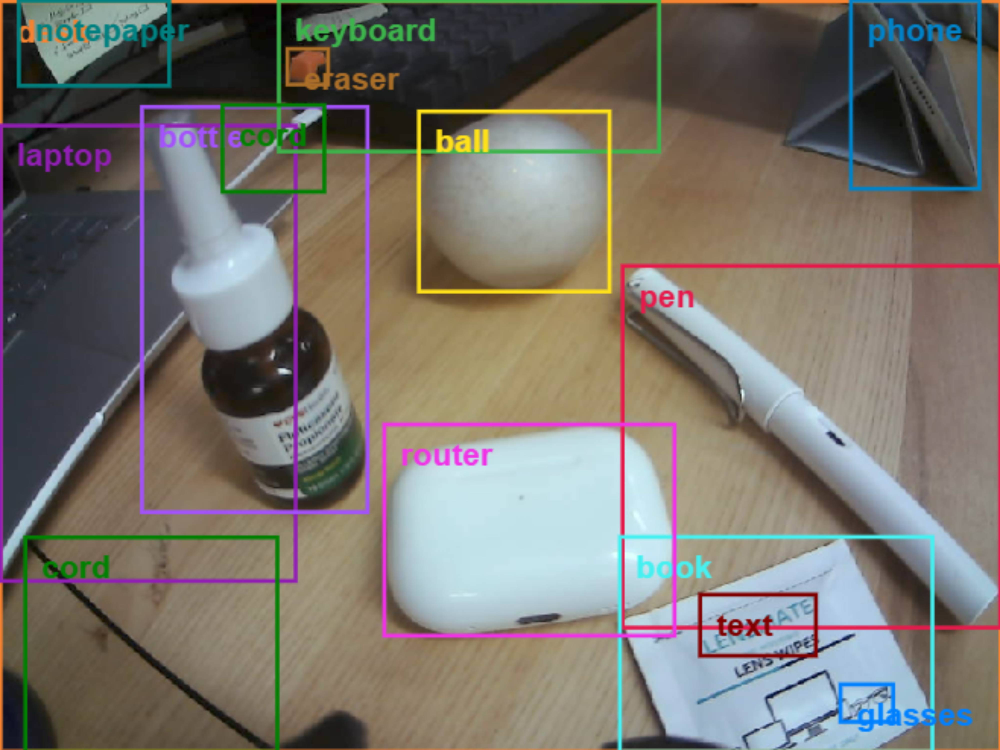

2. reflective pc surface
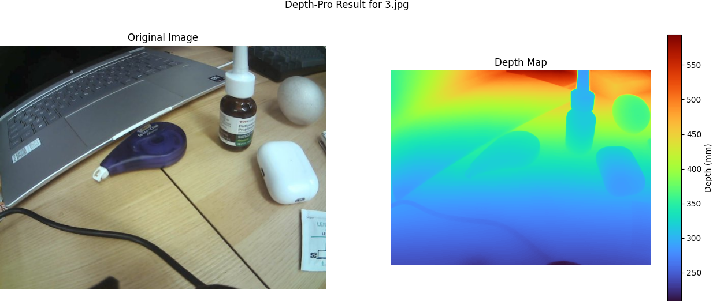
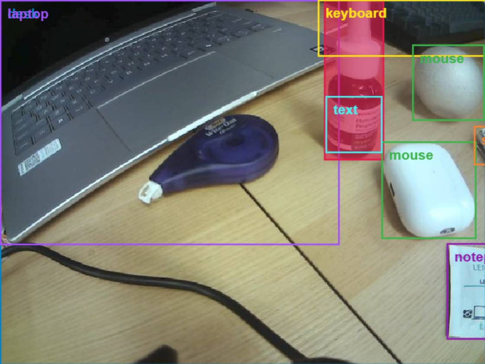

3. keyboard (clear)
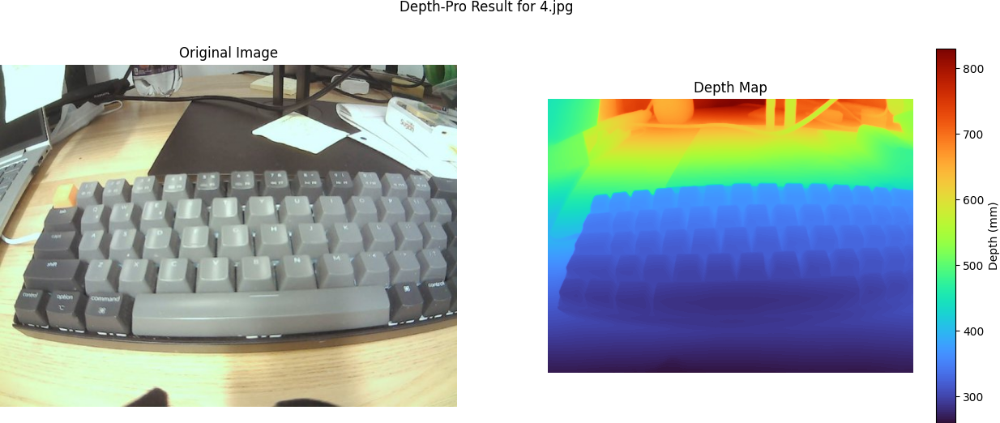
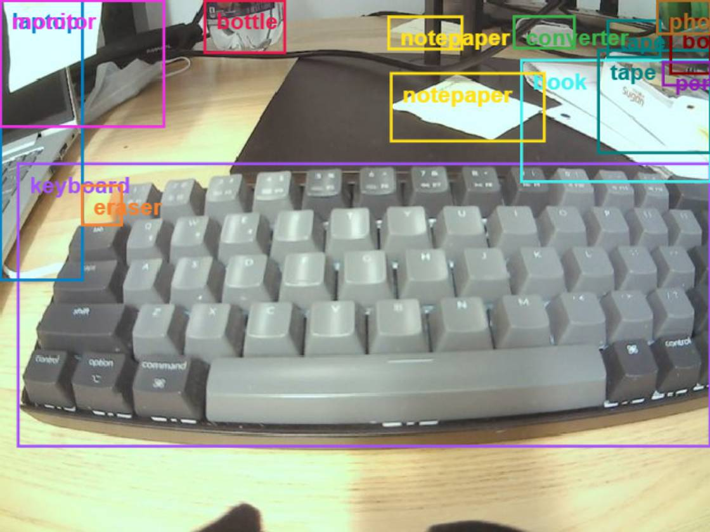

3. keyboard (unclear)
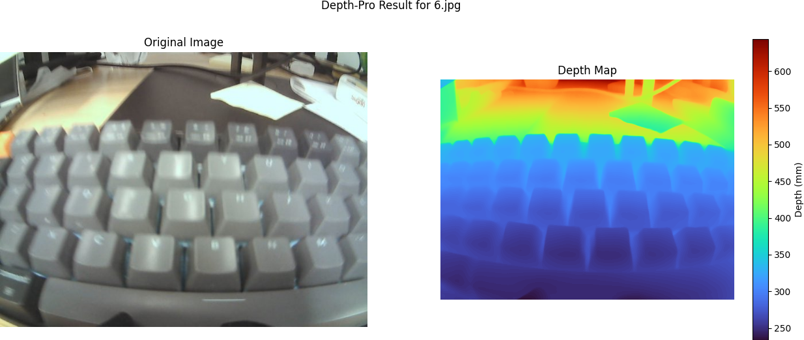

4. white paper
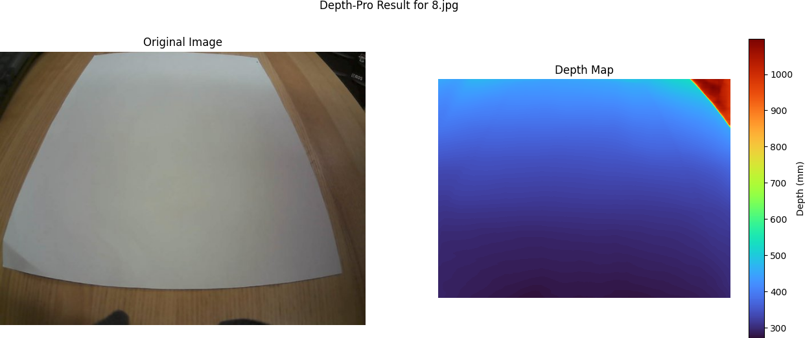
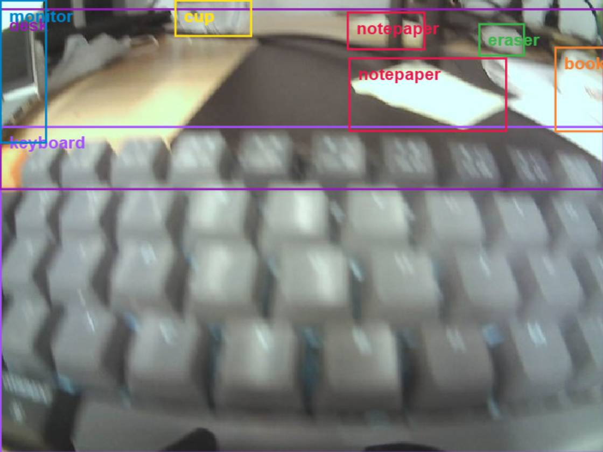

## iPhone SE 2022 Result

Summary of Depth Statistics:
- Minimum Depth Range: 264.03m to 570.01m
- Maximum Depth Range: 1099.27m to 2549.09m
- Mean Depth Range: 532.19m to 1109.28m

1. 10cm level from koch robot
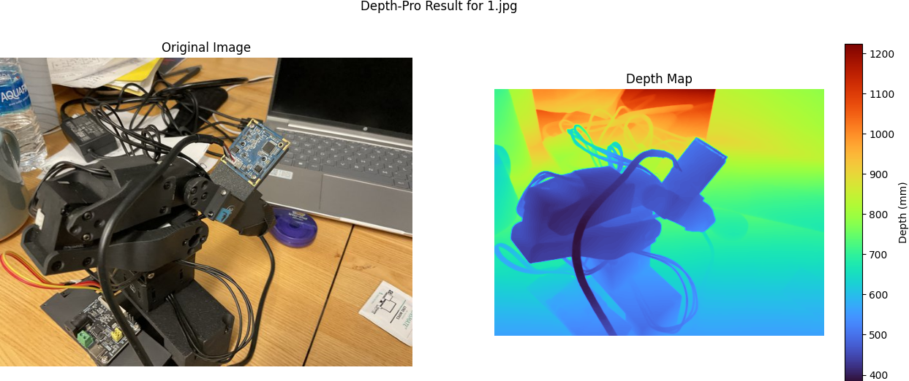
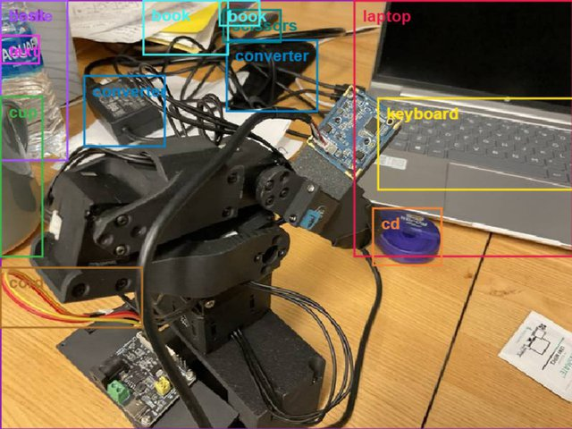

2. 30cm level from objects
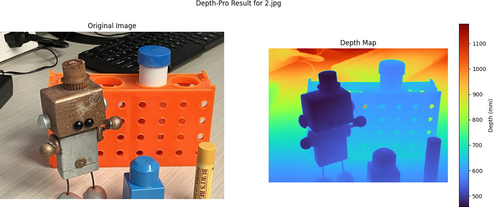
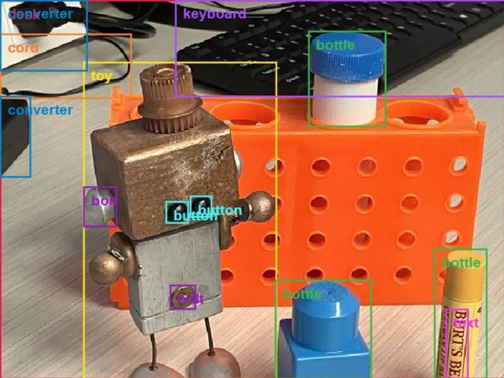

3. Looking at objects at eye level
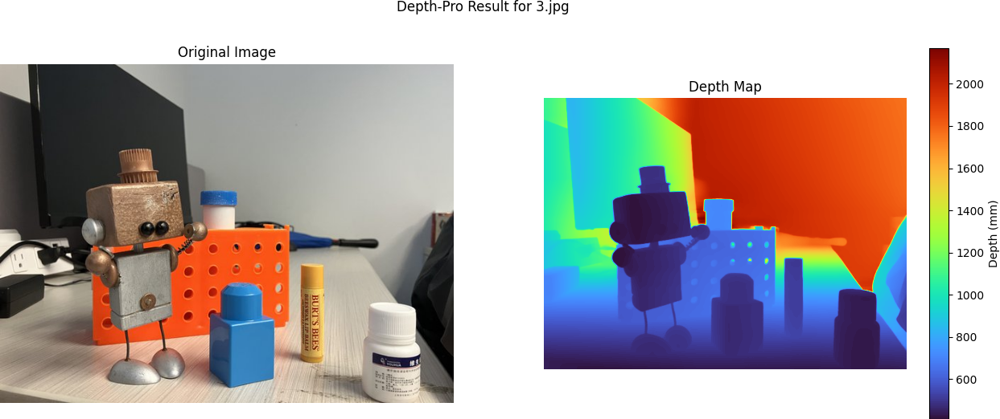
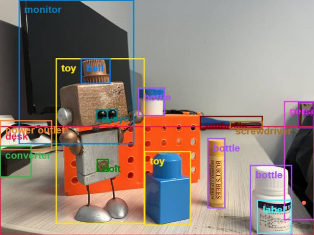

4. 50cm level from objects
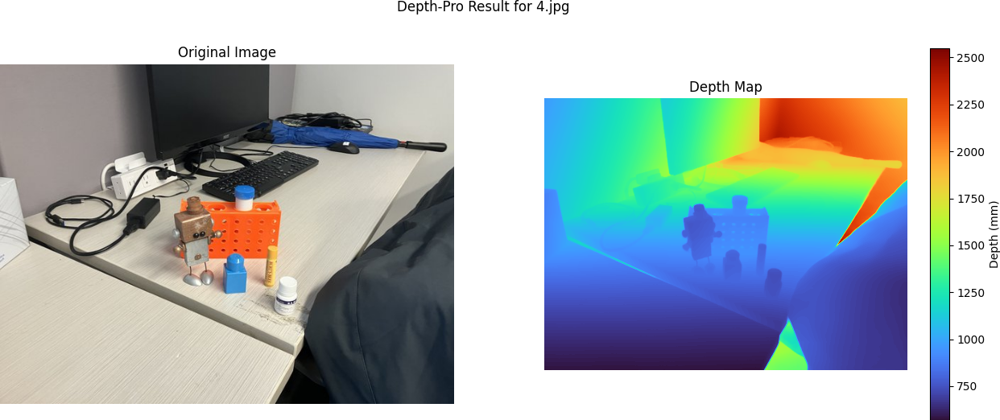
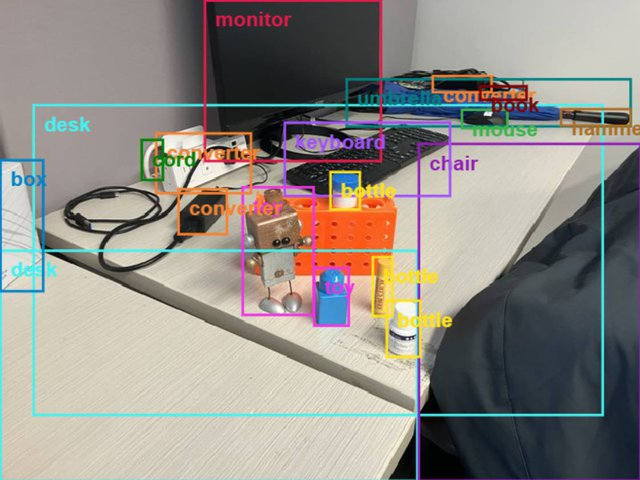

5. very close to objects
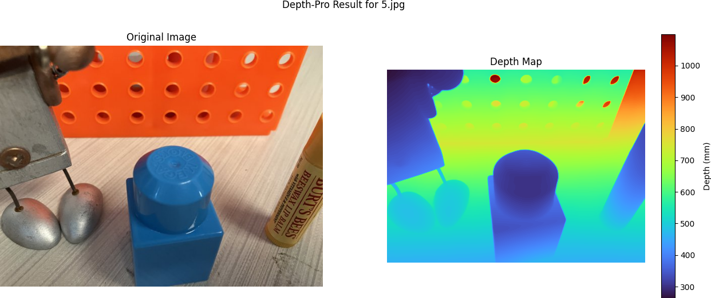
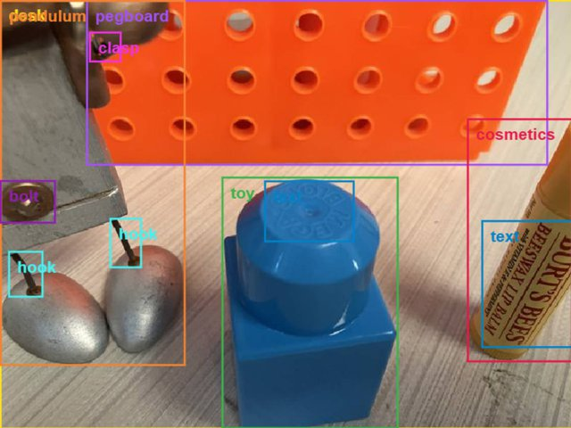

max depth is incorrect

## Conclusion

Currently, the depth image by Koch Robot's on-wrist camera is not as good as phone or realsense's. 

Relative depth is very good, but metric depth is yet to be tested.

But I think it is still useful for very close manipulation task.

Hope this can help research in our lab, I am glad to further test on it.

